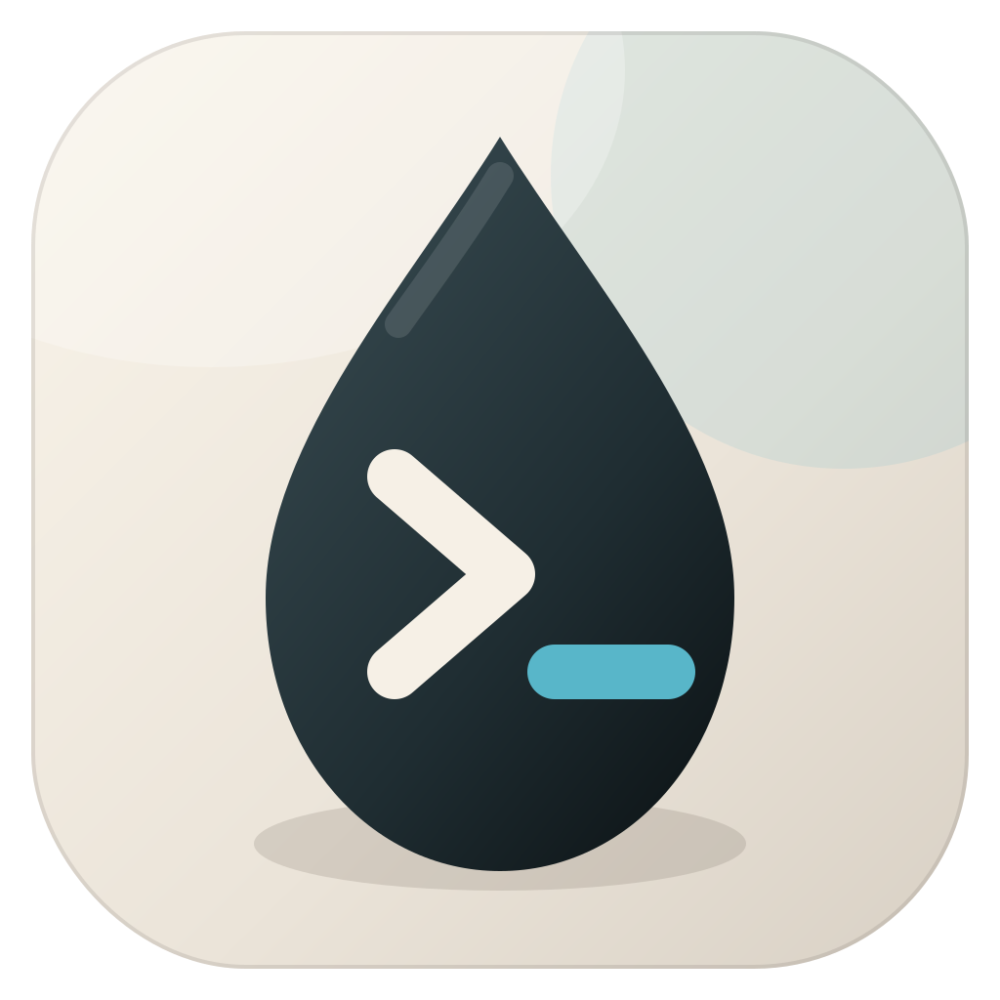

<p align="center">
  
</p>

<h1 align="center">ink</h1>

<p align="center">为 macOS 编写的原生终端模拟器，优先把性能和内存做好。</p>

ink 使用 Swift 6、AppKit、Metal 和 CoreText 构建。它不是浏览器终端，也不把现成终端内核包进一层新外壳。PTY、VT 解析、字符网格、scrollback、输入与渲染都在项目内实现，目标是在保持终端兼容性的同时，让热路径足够短、常驻内存足够可控。

应用图标名为「雾白墨滴」：墨滴对应 **ink**，内嵌的 `>_` 对应终端，暖雾色底板则延续应用侧边栏的材质与明暗主题。

> [!IMPORTANT]
> ink 目前是可运行的开发版本，还没有提供面向普通用户的 `.app` 安装包。核心终端、项目外壳、配置热重载和性能基准已经落地，120 Hz 真实交互下的最终 Instruments 验收仍在进行。

## 现在能做什么

### 原生终端

- 通过 `forkpty` 启动用户的 login shell，会话从项目目录开始。
- 增量解析 UTF-8 与 VT 序列，支持常用 CSI、OSC、DCS、ESC、SGR、DEC 私有模式和备用屏。
- 支持 16 色、256 色与 truecolor，处理粗体、斜体、下划线、删除线、反色和暗色。
- 支持中文、宽字符、组合字符、Variation Selector 与 ZWJ emoji。
- 通过 `NSTextInputClient` 接入 macOS 输入法，并支持 Option-as-Meta。
- 支持 bracketed paste、应用光标键、鼠标上报、滚轮历史浏览和备用屏滚动。
- 支持普通选区、双击选词、三击选行与 Option 矩形选择。

### Metal 渲染

- `CAMetalLayer` 承载终端内容区，CoreText 负责字体度量与字形栅格化。
- 单色与彩色字形使用独立 atlas，彩色 emoji atlas 在首次需要时才分配。
- 可见 cell 通过实例化绘制，每帧一次 draw call。
- 只在内容、光标或窗口状态变化时绘制，并跟随屏幕刷新率。
- Block Elements 使用几何图形绘制，避免 Powerline、进度条等字符出现拼接缝隙。

### 项目与会话

- 用目录组织项目，每个项目可拥有多个终端会话。
- 支持新增、移除、拖动排序、置顶项目与编辑备注。
- 支持 Ghostty 风格标签栏、标签重命名、会话切换和快捷键选择。
- 项目列表、置顶状态、备注、当前项目与窗口尺寸会持久化。
- 所有会话共用一个终端视图，避免为后台标签保留额外的 Metal layer 与字形图集。

### 外观与配置

- 侧边栏使用 macOS 原生材质，界面自动跟随系统浅色或深色模式。
- 颜色、间距、圆角、排版和终端调色板集中在 `InkDesign` 中管理。
- 设置直接在主窗口内容区打开，不会创建第二个偏好设置窗口。
- 外观、终端配色、启动侧边栏、默认窗口大小、字体、光标、Option-as-Meta、选中即复制和 scrollback 容量可配置。
- 配置文件变更会自动重载，无需重启应用。
- 可将全部已知设置上传到 iCloud，并在另一台 Mac 上手动确认拉取。

## 快速开始

### 环境要求

- macOS 14.0 或更高版本
- Xcode 或支持 Swift 6 的 Command Line Tools

### 构建与运行

```bash
git clone https://github.com/CheneyCh0u/ink.git
cd ink
swift run ink
```

SwiftPM 启动时会加载与未来 `.app` 打包相同的应用图标。

运行测试：

```bash
swift test
```

运行 scrollback、解析吞吐与 reflow 基准：

```bash
swift run -c release ink-bench
```

## 配置

用户配置位于：

```text
~/.config/ink/config.toml
```

所有字段都可省略。配置文件不存在或某个值无效时，ink 会使用默认值继续启动。
也可以从顶部标签栏右侧的齿轮或 <kbd>⌘ ,</kbd> 打开内嵌设置页。设置页写回
已知字段时会保留文件中的注释、空行和未知键。

```toml
[appearance]
mode = "system" # system | light | dark

[sidebar]
startup_mode = "expanded" # expanded | compact | hidden

[window]
remember_frame = true
width = 1280
height = 800

[font]
family = "JetBrains Mono"
size = 14.0
line_height = 1.2

[terminal]
theme = "neutral" # warm | graphite | pine | plum | neutral

[cursor]
style = "block" # block | bar | underline
blink = true

[input]
option_as_meta = true

[selection]
copy_on_select = false

[scrollback]
lines = 100_000
```

`appearance`、终端配色、字体、光标和交互设置会立即应用；每套终端配色会根据
界面外观自动切换浅色或深色版本。`sidebar.startup_mode` 与默认窗口尺寸在下次
启动时生效，`scrollback.lines` 只影响新会话。

设置页的 iCloud 分组提供“自动上传配置”开关，以及“上传到云端”和“拉取云端配置”
两个手动按钮。打开自动上传时会立即上传当前配置，之后只在本机配置变化后上传；Ink
不会自动拉取或轮询云端。拉取不同配置前会要求确认，并继续保留本机 TOML 的注释和
未知字段。直接 `swift run` 或使用 ad-hoc 签名的构建可能显示 iCloud 不可用；该能力
需要与应用标识匹配的 Apple iCloud capability 和 provisioning。

## 常用快捷键

| 操作 | 快捷键 |
|---|---|
| 新建项目 | <kbd>⌘ N</kbd> |
| 打开设置 | <kbd>⌘ ,</kbd> |
| 新建会话 | <kbd>⌘ T</kbd> |
| 关闭会话 | <kbd>⌘ W</kbd> |
| 切换侧边栏 | <kbd>⌘ 0</kbd> |
| 选择会话 1 到 9 | <kbd>⌘ 1</kbd> 到 <kbd>⌘ 9</kbd> |
| 上一个或下一个会话 | <kbd>⇧ ⌘ [</kbd> / <kbd>⇧ ⌘ ]</kbd> |
| 强制本地矩形选择 | 按住 <kbd>⌥</kbd> 后拖动 |

当终端程序启用鼠标上报时，按住 Option 可绕过上报并在本地选择文本。

## 架构

```text
ink
└── InkShell                 窗口、侧边栏、标签与会话协调
    ├── InkTerminalView      NSView、Metal、CoreText、输入法与选区
    ├── TerminalCore         VT 解析、grid、scrollback 与 reflow
    ├── InkPTY               forkpty、异步 I/O 与窗口尺寸同步
    ├── InkConfig            极小 TOML 子集与配置热重载
    └── InkDesign            全局视觉 token 与终端调色板
```

依赖只能从外壳指向内核。`TerminalCore` 是纯 Swift 模块，不依赖 AppKit 或 Metal，因此 VT 行为、字符宽度、选区、压缩存储与 reflow 都能脱离窗口测试。

项目坚持零第三方运行时依赖。新增依赖需要同时说明功能收益、常驻内存和二进制体积成本。

## 性能与内存

下面是 Apple Silicon、macOS 26.5、2x 缩放环境下的当前记录。不同机器上的绝对值会变化，完整方法与分析见 [docs/perf.md](docs/perf.md)。

| 项目 | 当前结果 |
|---|---:|
| 10 万行 ASCII，平均 40 列 | 9.3 MB 增量 |
| 10 万行 ASCII，满 200 列 | 24.5 MB 增量 |
| 10 万行彩色输出，约 80 列 | 49.0 MB 增量 |
| 10 万行中文，80 列 | 74.7 MB 增量 |
| 解析吞吐 | 47 至 82 MB/s |
| 10 万行 reflow | 约 29 ms |
| 1280 × 800、2x 大窗口空闲内存 | 约 63 MB |

scrollback 的 200 MB 目标已经达成。大窗口空闲内存目前主要来自两块全窗口 Metal drawable，1x 或较小窗口可低于 50 MB。120 Hz 稳定性和热路径 ARC 仍需在真实交互负载下完成 Instruments 验收。

为守住这些数字，核心实现遵循几条硬约束：

- `Cell` 固定为 8 字节，`RowInfo` 固定为 2 字节，并有测试防止尺寸回退。
- grid 使用连续内存与环形行索引，不使用 `Array<Array<Cell>>`。
- scrollback 入库时裁掉尾部空白，纯 ASCII 默认属性行使用 1 字节每格的紧凑格式。
- truecolor 与组合字符放在旁路表中，避免增加每个 cell 的常驻开销。
- 性能改动以采样和基准为依据，不用直觉代替 Instruments。

## 路线图

接下来仍在范围内的工作包括搜索、URL 与 OSC 8、OSC 52、通知、更多快捷键、OSC 133 交互增强，以及正式 `.app` 打包。

ink 明确不做内联图片协议、tmux control mode、内置 SSH、插件系统、跨平台支持和内置 AI。这些边界用于保护终端内核的性能、内存和可维护性。完整范围与优先级见 [docs/roadmap.md](docs/roadmap.md)。

## 文档

- [技术栈与架构](docs/tech-stack.md)
- [功能范围与路线图](docs/roadmap.md)
- [grid 与 scrollback 设计](docs/grid-design.md)
- [性能与内存验收](docs/perf.md)
- [视觉系统与应用图标](docs/design-system.md)
- [macOS 构建与发布](docs/release.md)
